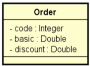
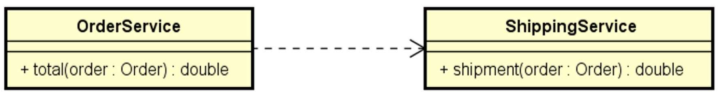

# Desafio 1 DevSuperior - Componentes e Injeção de dependência (DI)
Primeiro desafio do curso Java Spring Professional do Professor Nélio Alves - Dev Superior.

## Descrição do desafio:
Você deve criar um sistema para calcular o valor total de um pedido, considerando uma porcentagem
de desconto e o frete. O cálculo do valor total do pedido consiste em aplicar o desconto ao valor
básico do pedido, e adicionar o valor do frete. A regra para cálculo do frete é a seguinte:

| **Valor básico do pedido (sem desconto)** | **Frete** |
|-------------------------------------------|-----------|
| Abaixo de R$ 100.00                       | R$ 20.00  |
| De R\$ 100.00 até R\$ 200.00 exclusive    | R$ 12.00  |
| R$ 200.00 ou mais                         | Grátis    |

Sua solução deverá seguir as seguintes especificações:
Um pedido deve ser representado por um objeto conforme projeto abaixo:

A lógica do cálculo do valor total do pedido deve ser implementada por componentes (serviços), cada
um com sua responsabilidade, conforme projeto abaixo:

Serviço OrderService: responsável por operações referentes a pedidos.
Serviço ShippingService: responsável por operações referentes a frete.

Sua solução deverá ser implementada em Java com Spring Boot. A saída deverá ser mostrada no log
do terminal da aplicação. Cada serviço deve ser implementado como um componente registrado com
@Service.

## Critérios de avaliação:
- [x] Valor correto da saída do programa;
- [x] Projeto de componentes implementado corretamente.

## Competências avaliadas:
- Criação de projeto Spring Boot;
- Configuração de componentes Spring e injeção de dependência;
- Implementação de projeto de componentes.